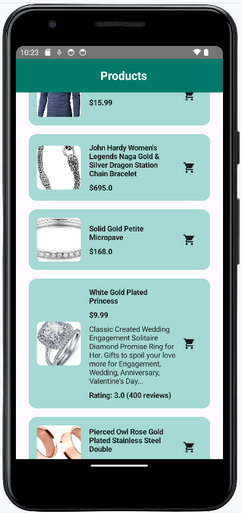

## Set Up Project Environment

Start a new Android Studio project with a Compose activity.

Add necessary dependencies to your `build.gradle` file

```kotlin
dependencies {
    implementation("com.squareup.retrofit2:retrofit:2.9.0")
    implementation("com.squareup.retrofit2:converter-gson:2.9.0")
    implementation("io.coil-kt:coil-compose:2.2.2")
    implementation("androidx.compose.runtime:runtime-livedata:1.5.0")
}
```

These dependencies include Retrofit for networking, Gson converter for JSON parsing, Coil-Compose for image loading in Jetpack Compose, and LiveData integration for observing data changes.

## Data Models

- Data models in Android applications define the structure of the data your app will work with, especially when fetching data from APIs.
- Define a Kotlin data class `Product` to represent the structure of product data fetched from the API.
- Data model should match the structure of the API response to facilitate smooth data parsing and avoid runtime errors.

```kotlin
// Product.kt

package com.example.myapiapplication

data class Rating(
    val rate: Double,
    val count: Int
)

data class Product(
    val id: Int,
    val title: String,
    val price: Double,
    val description: String,
    val category: String,
    val image: String,
    val rating: Rating
)


```

## Networking

### Setting up Retrofit to communicate with APIs

- Define API endpoints using an interface annotated with Retrofit annotations such as `@GET`, `@POST`, `@PUT`, etc. Define a method `getProducts()` to fetch a list of products.

### **Configure Retrofit with RetrofitClient**

- Configure Retrofit by creating a singleton `RetrofitClient` that builds a Retrofit instance with a base URL and Gson converter factory.

```kotlin
// RetrofitClient.kt

package com.example.myapiapplication

import retrofit2.Retrofit
import retrofit2.converter.gson.GsonConverterFactory
import retrofit2.http.GET

const val BASE_URL = "https://fakestoreapi.com/"

interface ProductService {
    @GET("products")
    suspend fun getProducts(): List<Product>
}

object RetrofitClient {
    val service: ProductService by lazy {
        Retrofit.Builder()
            .baseUrl(BASE_URL)
            .addConverterFactory(GsonConverterFactory.create())
            .build()
            .create(ProductService::class.java)
    }
}


```

- `ProductService`: An interface that defines the API endpoints.
- `@GET("/products")`: Retrofit annotation specifying the HTTP method (GET) and endpoint ("/products").
- `suspend fun getProducts()`: A suspend function that will asynchronously fetch a list of products. Retrofit handles the HTTP request and response parsing for you.
- `Retrofit.Builder()`: Starts building a new Retrofit instance.
- `.baseUrl(BASE_URL)`: Sets the base URL for the API.
- `.addConverterFactory(GsonConverterFactory.create())`: Adds Gson converter factory to convert JSON responses to Kotlin objects using Gson.
- `.build()`: Constructs the Retrofit instance.
- `object RetrofitClient`: Singleton object holding the Retrofit instance.
- `val productService`: Lazily initializes the `ProductService` interface using `retrofit.create(ProductService::class.java)`.

## **Repository**

- It acts as an intermediary between different data sources (like network, local database, or any other data storage) and the rest of the application.
- Its primary responsibility is to abstract the data sources and provide a clean API for accessing and manipulating data.
- In the MVVM pattern , the Repository fits into this architecture by providing data to the ViewModel. The ViewModel then exposes this data to the UI (View) layer through LiveData or State in Jetpack Compose.

```kotlin
// ProductRepository.kt

package com.example.myapiapplication

class ProductRepository(private val apiService: ProductService) {
    suspend fun getProducts(): List<Product> {
        return apiService.getProducts()
    }
}

```

- `ProductRepository`: Handles data operations and acts as a bridge between ViewModel and network operations.
- `getProducts()`: Uses `productService` to fetch products asynchronously in a coroutine scope (`Dispatchers.IO` context).

## ViewModel

- Implement `ProductViewModel` to manage UI-related data. Use `ViewModel` and `LiveData` to hold and update the list of products fetched from the repository.
- Implement `fetchProducts` method in ViewModel to asynchronously fetch products using `viewModelScope` and update `LiveData`.

```kotlin
// ProductViewModel.kt

package com.example.myapiapplication

import androidx.lifecycle.LiveData
import androidx.lifecycle.MutableLiveData
import androidx.lifecycle.ViewModel
import androidx.lifecycle.ViewModelProvider
import androidx.lifecycle.viewModelScope
import kotlinx.coroutines.launch


class ProductViewModel(private val repository: ProductRepository) : ViewModel() {
    private val _products = MutableLiveData<List<Product>>()
    val products: LiveData<List<Product>> get() = _products

    init {
        fetchProducts()
    }

    private fun fetchProducts() {
        viewModelScope.launch {
            try {
                val productList = repository.getProducts()
                _products.postValue(productList)
            } catch (e: Exception) {
                // Handle the exception
            }
        }
    }
}

class ProductViewModelFactory(private val repository: ProductRepository) : ViewModelProvider.Factory {
    override fun <T : ViewModel> create(modelClass: Class<T>): T {
        if (modelClass.isAssignableFrom(ProductViewModel::class.java)) {
            @Suppress("UNCHECKED_CAST")
            return ProductViewModel(repository) as T
        }
        throw IllegalArgumentException("Unknown ViewModel class")
    }
}


```

- `ProductViewModel`: Extends `ViewModel` and initializes with `ProductRepository`.
- `_products`: MutableLiveData to hold the list of products.
- `products`: LiveData exposed to observe changes in the list of products from UI components.
- `fetchProducts()`: Asynchronously fetches products using `viewModelScope.launch` coroutine. Updates `_products` with fetched data from `ProductRepository`.
- `ProductViewModelFactory`: Provides `ProductViewModel` instances using `ProductRepository`.

## Design UI Components with Jetpack Compose

- **Create Composables:** Implement Jetpack Compose functions for UI components like `MyApp`, `ProductList`, and `ProductCard`.
- **UI Logic:** Define UI interactions

```kotlin
// ProductView.kt

package com.example.myapiapplication

import androidx.compose.animation.animateContentSize
import androidx.compose.animation.core.spring
import androidx.compose.foundation.clickable
import androidx.compose.foundation.layout.*
import androidx.compose.foundation.lazy.LazyColumn
import androidx.compose.foundation.lazy.items
import androidx.compose.foundation.shape.RoundedCornerShape
import androidx.compose.material3.*
import androidx.compose.material.icons.Icons
import androidx.compose.material.icons.filled.ShoppingCart
import androidx.compose.runtime.Composable
import androidx.compose.runtime.getValue
import androidx.compose.runtime.mutableStateOf
import androidx.compose.runtime.remember
import androidx.compose.runtime.setValue
import androidx.compose.ui.Alignment
import androidx.compose.ui.Modifier
import androidx.compose.ui.draw.clip
import androidx.compose.ui.graphics.graphicsLayer
import androidx.compose.ui.layout.ContentScale
import androidx.compose.ui.text.font.FontWeight
import androidx.compose.ui.unit.dp
import coil.compose.AsyncImage
import com.example.myapiapplication.ui.theme.MyAPIApplicationTheme
import com.example.myapiapplication.ui.theme.Green
import com.example.myapiapplication.ui.theme.LightTeal
import com.example.myapiapplication.ui.theme.OnPrimary
import com.example.myapiapplication.ui.theme.OnSecondary

@OptIn(ExperimentalMaterial3Api::class)
@Composable
fun ProductView(products: List<Product>) {
    MyAPIApplicationTheme {
        MyApp {
            ProductList(products = products)
        }
    }
}

@OptIn(ExperimentalMaterial3Api::class)
@Composable
fun MyApp(content: @Composable () -> Unit) {
    Scaffold(
        topBar = {
            TopAppBar(
                title = {
                    Box(
                        modifier = Modifier
                            .fillMaxWidth()
                            .wrapContentWidth(Alignment.CenterHorizontally)
                    ) {
                        Text(
                            text = "Products",
                            color = OnPrimary, // Use OnPrimary color from theme
                            fontWeight = FontWeight.Bold,
                        )
                    }
                },
                colors = TopAppBarDefaults.topAppBarColors(
                    containerColor = Green
                )
            )
        },
        content = { paddingValues ->
            Box(modifier = Modifier.padding(paddingValues)) {
                content()
            }
        }
    )
}

@Composable
fun ProductList(products: List<Product>) {
    LazyColumn(contentPadding = PaddingValues(16.dp)) {
        items(products) { product ->
            ProductCard(product)
        }
    }
}

@Composable
fun ProductCard(product: Product) {
    var expanded by remember { mutableStateOf(false) }

    Card(
        modifier = Modifier
            .fillMaxWidth()
            .padding(8.dp)
            .clickable { expanded = !expanded }
            .animateContentSize(animationSpec = spring()),
        colors = CardDefaults.cardColors(
            containerColor = LightTeal // Set the container color to LightTeal
        ),
        shape = RoundedCornerShape(16.dp) // Optional: round corners of the card
    ) {
        Row(
            modifier = Modifier
                .fillMaxWidth()
                .padding(16.dp),
            verticalAlignment = Alignment.CenterVertically
        ) {
            Box(
                modifier = Modifier
                    .weight(1f)
                    .aspectRatio(1f) // Make the Box square
                    .clip(RoundedCornerShape(8.dp)) // Clip to rounded corners
            ) {
                AsyncImage(
                    model = product.image,
                    contentDescription = product.title,
                    modifier = Modifier
                        .fillMaxSize() // Make the image fill the Box
                        .graphicsLayer { shadowElevation = 4.dp.toPx() }, // Add shadow
                    contentScale = ContentScale.Crop // Scale the image to fill the Box
                )
            }
            Spacer(modifier = Modifier.width(16.dp))
            Column(modifier = Modifier.weight(2f)) {
                Text(text = product.title, fontWeight = FontWeight.Bold)
                Spacer(modifier = Modifier.height(8.dp))
                Text(
                    text = "$${product.price}",
                    fontWeight = FontWeight.Bold
                )
                if (expanded) {
                    Spacer(modifier = Modifier.height(8.dp))
                    Text(text = product.description)
                    Spacer(modifier = Modifier.height(8.dp))
                    Text(
                        text = "Rating: ${product.rating.rate} (${product.rating.count} reviews)",
                        color = OnSecondary,
                        fontWeight = FontWeight.Bold
                    )
                }
            }
            IconButton(onClick = { /* Handle add to cart action here */ }) {
                Icon(Icons.Filled.ShoppingCart, contentDescription = "Add to Cart")
            }
        }
    }
}


```

## MainActivity.kt

```kotlin
// MainActivity.kt

package com.example.myapiapplication


import android.os.Bundle
import androidx.activity.ComponentActivity
import androidx.activity.compose.setContent
import androidx.activity.viewModels
import androidx.compose.runtime.livedata.observeAsState
import androidx.compose.runtime.getValue


class MainActivity : ComponentActivity() {
    private val productViewModel: ProductViewModel by viewModels {
        ProductViewModelFactory(ProductRepository(RetrofitClient.service))
    }

    override fun onCreate(savedInstanceState: Bundle?) {
        super.onCreate(savedInstanceState)
        setContent {
            MyApp {
                val products by productViewModel.products.observeAsState(emptyList())
                ProductList(products)
            }
        }
    }
}


```

- **MainActivity** is launched, `onCreate` is called.
- **`onCreate` Method**: Overrides the lifecycle method to set up the activity when it is created.
- **`setContent`**: Sets the content of the activity with Jetpack Compose.
- **`MyApplicationTheme`**: Sets the theme for the entire app. Ensure this theme is defined in your `themes.xml` or `themes.kt` file.
- **`MyApp` Composable**: Used as the top-level composable function. It sets up the basic structure of the UI for the app.
- **`viewModel`**: Initializes an instance of `ProductViewModel` using `viewModels` delegate from `androidx.activity.compose` package.
- `viewModels` and `observeAsState` are used to observe changes in `ProductViewModel.products` LiveData.
- **`setContent`**: Sets the content of the activity using `MyApp` composable function wrapped in the `MyApplicationTheme`
- Set the content of the activity to `MyApp`, passing the product list from ViewModel to `ProductList`..
- **`viewModel.products.observeAsState(emptyList())`**: Observes the `products` LiveData from `ProductViewModel` and provides its current state (`List<Product>`) as a state value (`products`). If `products` LiveData updates, `products` state will reflect those changes.
- **`ProductList(products = products, onItemClick = { /* Handle item click */ })`**: Passes the observed `products` state to the `ProductList` composable, which will display the list of products.


### OUTPUT 


### [Check source code of the application ](https://github.com/j-swati/Android-development-classes/tree/main/MyAPIApplication)

